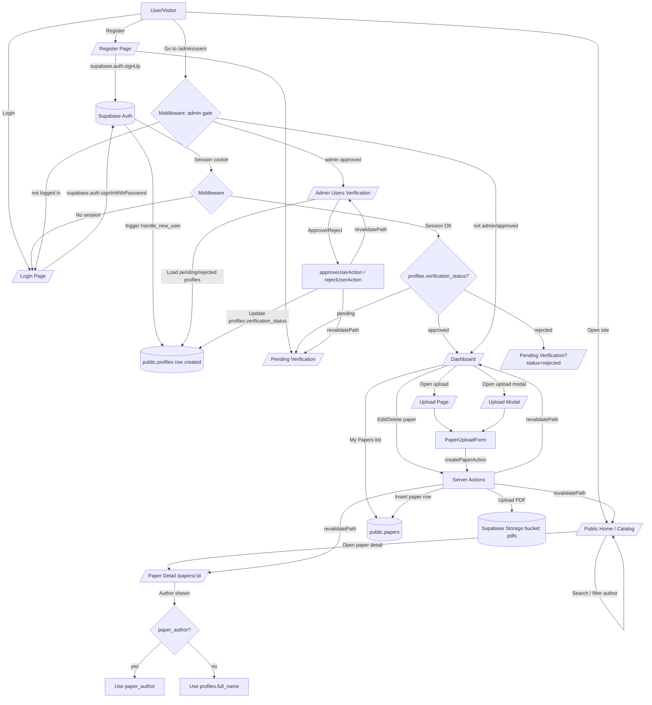

## System Flowchart

```mermaid
flowchart TD
  U[User/Visitor] -->|Open site| HOME[/Public Home / Catalog/]
  HOME -->|Search / filter author| HOME
  HOME -->|Open paper detail| DETAIL[/Paper Detail /papers/:id/]

  U -->|Register| REG[/Register Page/]
  U -->|Login| LOGIN[/Login Page/]

  REG -->|supabase.auth.signUp| AUTH[(Supabase Auth)]
  AUTH -->|trigger handle_new_user| PROF[(public.profiles row created)]
  REG --> PENDING[/Pending Verification/]

  LOGIN -->|supabase.auth.signInWithPassword| AUTH
  AUTH -->|Session cookie| MW{Middleware}

  MW -->|No session| LOGIN
  MW -->|Session OK| CHECK{profiles.verification_status?}

  CHECK -->|approved| DASH[/Dashboard/]
  CHECK -->|pending| PENDING
  CHECK -->|rejected| PENDINGR[/Pending Verification?status=rejected/]

  DASH -->|My Papers list| PAPERS[(public.papers)]
  DASH -->|Open upload| UPLOAD[/Upload Page/]
  DASH -->|Open upload modal| UPLOADMODAL[/Upload Modal/]
  DASH -->|Edit/Delete paper| ACTIONS[Server Actions]

  UPLOAD --> FORM[PaperUploadForm]
  UPLOADMODAL --> FORM
  FORM -->|createPaperAction| ACTIONS
  ACTIONS -->|Upload PDF| STORAGE[(Supabase Storage bucket: pdfs)]
  ACTIONS -->|Insert paper row| PAPERS
  ACTIONS -->|revalidatePath| DASH
  ACTIONS -->|revalidatePath| HOME
  ACTIONS -->|revalidatePath| DETAIL

  DETAIL -->|Author shown| AUTHOR{paper_author?}
  AUTHOR -->|yes| PA[Use paper_author]
  AUTHOR -->|no| PN[Use profiles.full_name]

  U -->|Go to /admin/users| ADMINMW{Middleware: admin gate}
  ADMINMW -->|not logged in| LOGIN
  ADMINMW -->|not admin/approved| DASH
  ADMINMW -->|admin approved| ADMIN[/Admin Users Verification/]

  ADMIN -->|Load pending/rejected profiles| PROF
  ADMIN -->|Approve/Reject| ADMINA[approveUserAction / rejectUserAction]
  ADMINA -->|Update profiles.verification_status| PROF
  ADMINA -->|revalidatePath| ADMIN
  ADMINA -->|revalidatePath| PENDING
```

